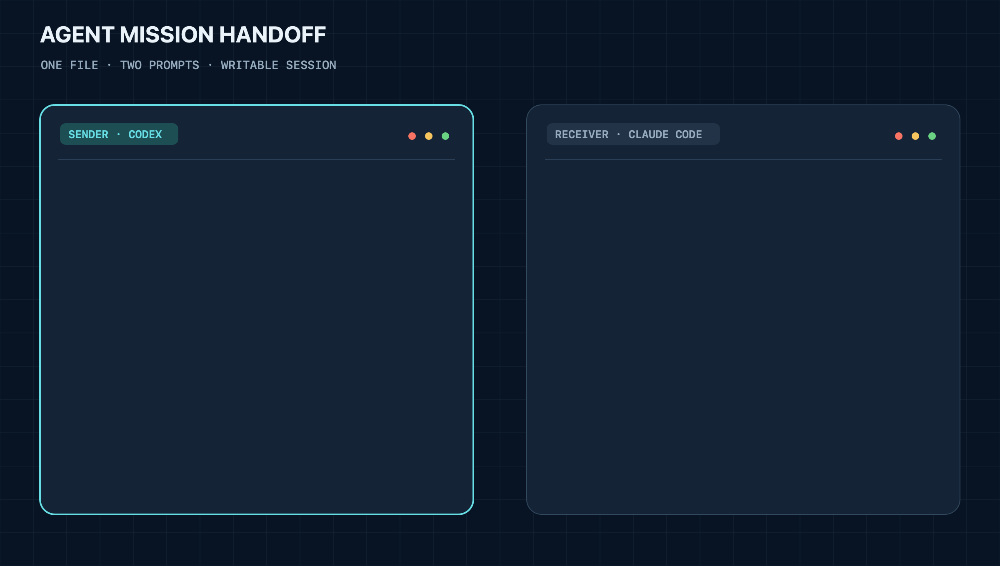

# Agent Mission Handoff

**English** | [简体中文](README.zh-CN.md)

[](https://github.com/Fume-shroom/agent-mission-handoff/actions/workflows/ci.yml)
[](https://github.com/Fume-shroom/agent-mission-handoff/releases/latest)
[](https://github.com/Fume-shroom/agent-mission-handoff/blob/main/LICENSE)
[](https://go.dev/dl/)

**Hand off a Codex or Claude Code task as one `.amh` file, then continue it locally in a writable Session.**

Codex ↔ Claude Code · local-first · no hosted service, account, database, or GitHub repository required

## Handoff In Two Prompts

- **Sender:** Tell your Agent **“Package the current task as an AMH file.”** → it creates `mission.amh` (`amh pack`).
- **Receiver:** Attach `mission.amh` and say **“Continue this task.”** → it restores a writable Session, presents a Mission Brief, and asks before continuing (`amh continue mission.amh`).

One prompt on each side. One file in between.

<p align="center">
  
</p>

## Install Once

The Agent-first path is:

> Install AMH from https://github.com/Fume-shroom/agent-mission-handoff and verify the installation.

Or install it directly.

macOS or Linux:

```bash
curl -fsSL https://raw.githubusercontent.com/Fume-shroom/agent-mission-handoff/main/install.sh | sh
```

Windows PowerShell:

```powershell
irm https://raw.githubusercontent.com/Fume-shroom/agent-mission-handoff/main/install.ps1 | iex
```

The installer verifies the release checksum and installs one CLI plus the Mission Handoff Skill for Codex and Claude Code. No Go toolchain or source checkout is required.

Verify at any time with `amh doctor`.

## What Happens After “Continue This Task”

- AMH validates the capsule, destination workspace, Git context, and relevant observed Skills, MCP servers, and CLIs.
- If a required local capability or mapping is unavailable, the Agent explains the relevant gap and asks once before installing, authenticating, remapping, or continuing without it.
- AMH creates a writable Session using safe semantic restore by default. The original history remains available as context rather than becoming trusted target instructions.
- The restored Agent starts with a Mission Brief: objective, history, completed work, open questions, environment gaps, and the proposed next action.
- No mission tools run and no source patch is applied until the user confirms.

## What The File Carries

One `.amh` file can contain:

- the objective, current progress, completed work, risks, and next actions;
- portable conversation history and the native source Session;
- workspace and Git identity;
- optional checked patches for tracked, untracked, and staged changes;
- observed Skills, MCP servers, and CLI tools with available source, version, and digest metadata;
- checksums and archive safety metadata.

AMH does not intentionally copy Agent credentials, login state, permission grants, running processes, private model state, or the complete repository. Session text and patches can still contain sensitive values. AMH performs best-effort high-confidence redaction by default, but review the file and use an approved transfer channel.

## Useful Commands

| Need | Command |
| --- | --- |
| Package the current task | `amh pack` |
| Restore and continue | `amh continue mission.amh` |
| Inspect without restoring | `amh inspect mission.amh` |
| Apply confirmed source changes | `amh apply mission.amh` |
| Verify the local setup | `amh doctor` |
| Update AMH | `amh update` |
| Remove AMH | `amh uninstall` |

## Supported Handoffs

| Source | Destination | Restore mode |
| --- | --- | --- |
| Codex | Codex | Safe writable semantic restore by default |
| Claude Code | Claude Code | Safe writable semantic restore by default |
| Codex | Claude Code | Semantic Session translation |
| Claude Code | Codex | Semantic Session translation |

For a capsule you fully trust, `--trust-native-session` enables a same-Agent native fork. AMH does not claim byte-exact reproduction of private runtime state or tool-call internals.

> Technical preview: Codex and Claude Code Session formats are private implementation details and may require adapter updates.

## Documentation

- [User guide and CLI reference](docs/USER_GUIDE.md)
- [Tutorials](docs/tutorials/README.md)
- [Architecture and capsule format](docs/ARCHITECTURE.md)
- [Security policy](SECURITY.md)
- [Contributing](CONTRIBUTING.md)

## License

MIT. Third-party attribution is recorded in [NOTICE](NOTICE).
