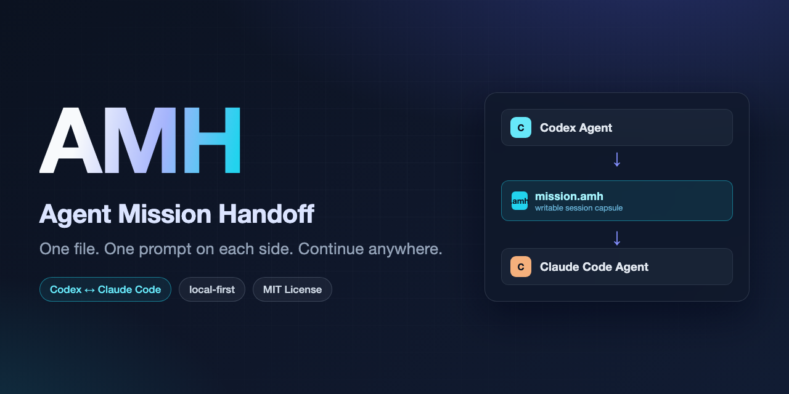

# AMH — Agent Mission Handoff

**Hand off a Codex or Claude Code task as one `.amh` file, then continue it
locally in a writable session.**

Codex ↔ Claude Code · local-first · no hosted service, account, database, or
GitHub repository required.



## Install

macOS or Linux:

```bash
curl -fsSL https://raw.githubusercontent.com/Fume-shroom/agent-mission-handoff/main/install.sh | sh
```

Windows PowerShell:

```powershell
irm https://raw.githubusercontent.com/Fume-shroom/agent-mission-handoff/main/install.ps1 | iex
```

## Documentation

- [User Guide](USER_GUIDE.md)
- [Architecture](ARCHITECTURE.md)
- [Tutorials](tutorials/README.md)
- [README](https://github.com/Fume-shroom/agent-mission-handoff#readme)

## Releases

Prebuilt binaries for macOS, Linux, and Windows are published on the
[Releases page](https://github.com/Fume-shroom/agent-mission-handoff/releases).
